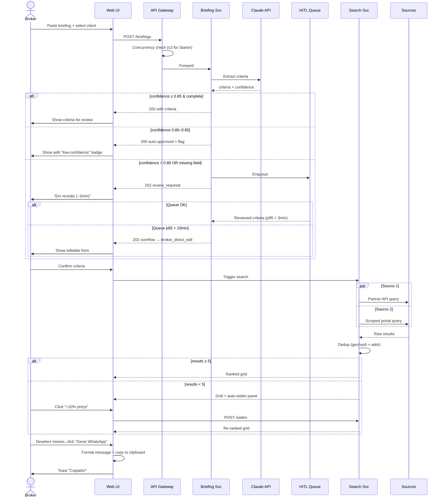

# Product Requirements Document
## PropMatch AI — Intelligent Property Matching & WhatsApp Distribution Platform

**Version:** 1.4 (post fourth-audit revision)
**Status:** Production-ready — converged. Further audits showing diminishing returns; recommend handoff to engineering.
**Document Owner:** Product Management
**Last Updated:** May 2026

**Changelog v1.4:** Legal dry-run added for manual LGPD deletions in MVP grace period; 3 new operational KPIs (HITL overflow auto-approval %, queue depth by hour, source failure streak); aggregated multi-source failure messaging; tooltip frequency capping for tier education; minimal multilingual Unicode handling spec; multi-broker office concurrency messaging differentiated from rate-limit; pilot qualitative interview rubric. No structural changes — v1.3 already production-ready per third audit.

**Changelog v1.3:** Sprint 5–6 parallelization plan added to de-risk launch; HITL peak-load simulation added to pilot plan; Source 3 contract template hooks specified; guest soft-archive education flow added (in-app banner, tooltip, day-510 warning); tier confusion mitigation expanded with locked-feature UI patterns and upgrade flow; auto-widen logic extended to ambiguous neighborhoods with alternative suggestions; new operational KPIs (HITL backlog %, partial returns/broker/day, clipboard error logs); spike throttling and p95 latency alerting; pilot success criteria formalized; sequence diagram for branching flow; glossary terms anchor-linked.

**Changelog v1.2:** HITL SLA defined with throughput targets and overflow rules; LGPD split into MVP-blocking minimum vs progressive compliance to de-risk Sprint 5–6; Source 3 partnership negotiation added as parallel pre-MVP track; guest client purge replaced with soft-archive logic that preserves briefing history; auto-widening logic for ambiguous criteria; concurrency limits per broker; new operational KPIs; visual Gantt chart; broker-facing partial results messaging; tier explicitly stated on every user story; visual feature matrix referenced.

**Changelog v1.1:** MVP scope reduced from 3 sources to 2 with API-first strategy; 8-week timeline replaced with 10-week MVP + buffer; HITL fallback for NLP extraction; mandatory client association; full LGPD policies; edge case stories; phased scaling targets; tier gating matrix; glossary upfront; MVP roadmap table.

---

## 0. Glossary (read first)

- **Briefing:** Free-form client message describing what they're looking for.
- **Fit score:** 0–100 ranking of how well a property matches a briefing's criteria.
- **Dedup:** Process of merging identical listings from multiple sources into one canonical property.
- **Geohash:** Encoded latitude/longitude string (precision 7 = ~150m cell).
- **pHash:** Perceptual image hash used to detect visually similar photos.
- **HITL (Human-in-the-Loop):** Workflow where a human reviewer validates AI output before it propagates downstream.
- **HITL SLA:** Maximum time a briefing waits in the review queue before reaching the broker.
- **WhatsApp Cloud API:** Meta's official server-side WhatsApp Business messaging API.
- **Guest client:** Auto-generated client record used when a broker runs a briefing without selecting a saved client; preserves history integrity.
- **Soft archive:** State where a record is hidden from default views but retained for dedup/history; opposite of hard delete.
- **Source:** A property data origin — partner API (preferred) or scraped portal (fallback).
- **Auto-widen:** Automatic relaxation of search criteria (price ±10%, radius +1km) when initial result count is below threshold.

---

## 1. Executive Summary

### 1.1 Vision & Value Proposition

PropMatch AI is an intelligent property-matching platform that compresses the broker's most time-consuming workflow — translating a client briefing into a curated, send-ready property list — from hours into seconds. By combining natural language understanding, multi-source aggregation (API-first), and structured WhatsApp output, PropMatch AI lets a single broker operate at the capacity of a small team without sacrificing curation quality.

The platform addresses a structural inefficiency in residential real estate: brokers spend 60–70% of their working time on low-leverage tasks (searching listing portals, deduplicating, formatting messages) instead of high-leverage activities (closing, prospecting, negotiation). PropMatch AI automates the search-to-send pipeline so brokers can focus on relationship and revenue work.

### 1.2 Quantified Value to a Single Broker

| Metric | Without PropMatch | With PropMatch | Delta |
|--------|-------------------|----------------|-------|
| Time per briefing | 90–120 min | 4–6 min | −95% |
| Briefings handled / week | 5–8 | 20–30 | +3× |
| Hours recovered / month | 0 | ~38 | +38h |
| Avg properties matched per briefing (target) | 8–12 (manual) | 12–18 (curated set, top-fit) | +50% |
| Estimated duplicate-send rate | 12–18% | < 2% | −85% |
| Estimated additional commission capacity | R$ 0 | R$ 4–6k | +R$ 4–6k |
| PropMatch subscription cost (Pro) | — | R$ 397/mo | — |
| **Net monthly upside (Pro tier)** | — | **R$ 3.6–5.6k** | — |

### 1.3 Key Objectives

| Objective | Baseline | Goal (12 mo) |
|-----------|----------|--------------|
| Search time per briefing | 90–120 min | < 5 min |
| Briefings handled / broker / week | 5–8 | 20+ |
| Match precision (broker-rated) | 40–55% | > 80% |
| Active brokers (WAU) | 0 | 1,500 |
| Briefing → property visit rate | 8% | 18% |
| MRR | R$ 0 | R$ 600k |

### 1.4 Definition of Success

PropMatch AI ships MVP by Week 10, reaches 200 paid brokers and R$ 60k MRR by Month 6, and demonstrates a measured 15× speed improvement and 1.8× conversion lift on the briefing-to-visit funnel by Month 12. Failing to hit two of three triggers a strategic pivot review.

---

## 2. Problem Statement

### 2.1 Current Market Situation

The Brazilian residential real estate market processes more than 1.2M transactions per year, with the long tail dominated by ~150,000 independent brokers and boutique agencies operating without the technology stack of large franchises. They rely on manual workflows across fragmented listing portals (ZAP Imóveis, VivaReal, Imovelweb, OLX, plus dozens of regional sites and partner brokerages).

The typical client interaction happens on WhatsApp — over 95% of broker-client communication runs there — yet none of the major listing portals export to WhatsApp-ready format. Brokers manually copy photos, addresses, prices, and links into curated messages, often producing 10–15 such messages per day per active client.

### 2.2 User Pain Points (Real Scenarios)

**Scenario A — Saturday morning grind.** Carla, broker in Pinheiros, receives a briefing at 9 AM: "2-bed apartment, Vila Madalena, up to R$ 950k, must allow pets, parking required." Four browser tabs, same filter set, 80+ listings, manual dedup, formatted WhatsApp message with 6 properties. Total: 2h15m. Client replies at 1 PM that two properties don't actually allow pets — listing was inaccurate.

**Scenario B — Lost lead.** Boutique agency receives 12 inbound leads on Friday. Single available agent processes 4 briefings before EOD. Other 8 leads get a generic "Monday" reply. By Monday, 5 of 8 have engaged a competitor.

**Scenario C — Formatting tax.** Senior broker André spends 20 minutes per briefing on *formatting* the WhatsApp message: shortening links, embedding photos, structuring price/area/amenities. He estimates this costs 8 hours a week.

### 2.3 Edge Case Scenarios with Auto-Resolution Logic

| Scenario | Frequency | Required behavior | Auto-resolution offered |
|----------|-----------|-------------------|--------------------------|
| Briefing missing critical field (no city) | ~12% | Block search, prompt broker | Suggest most-likely city from broker's recent briefings |
| Ambiguous location ("perto da Paulista") | ~25% | Resolve to canonical neighborhoods, ask radius | Default 1km radius from anchor; one-click expand to 2km/3km |
| Conflicting criteria ("2–3 quartos mas studio") | ~3% | Flag conflict in extraction review | Surface both options; broker picks |
| Vague high-end ("até 2M, frente pro mar") | ~8% | Run search but warn that filter is broad | Suggest narrowing to specific neighborhood ranges |
| Neighborhood not in portal database | ~5% | Match nearest indexed neighborhood + warn | Show 3 nearest alternatives ranked by geographic proximity; broker selects 1+ |
| Ambiguous neighborhood ("Vila Nova" — exists in 3 cities) | ~4% | Disambiguate before search | Show all candidate neighborhoods with city + map preview; broker confirms |
| Result count < 5 | ~15% | Offer auto-widen | Auto-widen +10% price OR +1km radius (broker chooses); re-run with one click |
| Result count = 0 | ~3% | Always offer auto-widen | Stack both wideners; show "your criteria are very specific" message |
| Briefing in mixed PT/EN | ~2% | LLM handles natively | None needed |
| Briefing > 2,000 chars | <1% | Reject with friendly message | Suggest summarizing key points |

### 2.4 Opportunity Size & Cost of Inaction

The addressable market in Brazil consists of ~150,000 independent brokers and ~12,000 boutique agencies (1–10 brokers). At R$ 197/month with conservative 5% penetration over 24 months, ARR opportunity ≈ R$ 19M. Adjacent LATAM markets (Mexico, Argentina, Colombia) double the TAM.

**Cost of inaction is asymmetric.** Brokers who don't adopt automation in the next 24 months will face: (1) franchise networks rolling out internal AI tools, raising table-stakes response time; (2) consumer expectations shifting toward instant curated suggestions (set by direct-to-consumer apps like QuintoAndar). Slow brokers will progressively lose mid-market clients to faster competitors.

---

## 3. Solution Overview

### 3.1 How It Works

The broker pastes a free-form briefing into PropMatch AI. An NLP layer extracts structured criteria (location, bedroom count, price ceiling, must-haves, soft preferences). An aggregation layer queries enabled sources in parallel, normalizes the results, deduplicates by geohash + address fuzzy match, and ranks by criteria fit. The broker sees a ranked grid, deselects misses, optionally adds personal notes, and clicks "Generate WhatsApp." The system produces a formatted message block that copies to clipboard or — at the Pro tier — sends directly via WhatsApp Cloud API.

### 3.2 Technical Approach & Key Decisions

| Decision | Choice | Rationale |
|----------|--------|-----------|
| NLP layer | LLM extraction (Claude) → schema validation → conditional HITL review | Briefings are unstructured; LLM handles variation; HITL catches errors during accuracy ramp-up |
| Source strategy | **API-first**, scraping as fallback only with explicit risk acceptance | APIs are stable and legal; scraping is fragile and exposes legal risk |
| MVP source set | 1 partner API (signed) + 1 scraped portal (with formal robots.txt review) | De-risks legal/technical exposure for MVP launch |
| **Source 3 contingency** | Pre-MVP partnership negotiation as parallel track; **API contract pre-signed and configurable as drop-in for Source 2** | If MVP scraped portal blocks, Source 3 (a second partner API) is contractually ready to swap in within 24h via feature flag |
| Deduplication (MVP) | Address normalization + geohash-7 only | Image pHash deferred to Phase 2 |
| Deduplication (Phase 2) | + image pHash (Hamming ≤ 6) | Adds precision once volume justifies it |
| WhatsApp delivery (MVP) | Clipboard-only | Removes Cloud API approval as launch dependency |
| WhatsApp delivery (Phase 2) | WhatsApp Cloud API for Pro tier | Premium differentiator post-MVP |
| Storage | PostgreSQL + Redis + S3 | Standard, no NoSQL complexity needed |
| Client association | Mandatory; auto-creates guest client; **soft-archive instead of hard delete** | Preserves dedup-against-history even after the 90-day mark |
| **Character encoding (MVP)** | UTF-8 end-to-end; accent-insensitive search; emoji-tolerant in briefings and notes | Brazilian brokers heavily use emoji and accented Portuguese; LLM extraction tested against accented and emoji-laden inputs. PT-PT and ES variants deferred to Year 2 but no architectural blockers. |

### 3.3 Core Differentiators

PropMatch AI differs from listing aggregators (ZAP, VivaReal) by being **broker-side, not consumer-side**: it doesn't compete for buyer attention; it amplifies broker output. It differs from CRMs (Anapro, Jetimob) by focusing on the *briefing-to-message* slice rather than full pipeline management. The defensible moat is multi-source coverage + WhatsApp-native output + briefing-to-list latency under 10 seconds — none of which any current competitor offers as an integrated workflow.

### 3.4 Source 3 Contract Template (audit-driven)

To make the contingency operationally real (not just a negotiation goal), every source partnership — including Source 3 — must be onboarded against a standard contract and integration template:

- **Contract floor:** 99% monthly uptime SLA, 60-day termination notice, daily rate limit ≥ 10K queries, support for filter set: city, neighborhood, bedrooms, price range, geo bounding box.
- **Integration adapter:** All sources implement a common `SourceAdapter` Python interface (`search()`, `health_check()`, `normalize_listing()`); swapping Source 2 for Source 3 is a feature-flag flip, not a code rewrite.
- **Pre-signed posture:** Source 3 signs a non-binding LOI by Wk5 and a final agreement by Wk8; integration adapter is implemented and tested against staging API by Wk9 even if not enabled in production.
- **Activation trigger:** Source 2 health falls below 80% success rate over 24h, OR Source 2 receives legal/cease-and-desist notice → Source 3 enabled within 24h via flag.

---

## 4. User Personas

### 4.1 Persona 1 — Carla, the Independent Broker

**Age:** 38 · **Role:** Independent broker, 6 years experience, São Paulo (Pinheiros / Vila Madalena focus)
**Tech proficiency:** Medium. Comfortable with WhatsApp, Instagram, listing portals; uncomfortable with spreadsheets beyond basic formulas.
**Workflow:** Receives leads via Instagram DM and WhatsApp referrals. Processes 6–10 briefings per week. Earns R$ 12–18k/month in commissions.
**Pain points:** Loses Saturdays searching across four sites; Instagram leads cool off; sends same property to clients twice.
**Quote:** *"If I could turn a client message into a list of 6 great properties in two minutes, I'd double my revenue. The bottleneck isn't talent, it's typing."*

### 4.2 Persona 2 — Renato, the Boutique Agency Owner

**Age:** 51 · **Role:** Owner-operator of a 4-broker agency in Belo Horizonte
**Tech proficiency:** Low-medium. Pays for Jetimob CRM but only uses 20% of it.
**Workflow:** Splits time between client meetings, team management, partner brokerage relationships. Team handles ~50 briefings/week combined; reviews all outgoing messages for quality.
**Pain points:** Junior brokers send sloppy WhatsApp messages; can't scale because each new broker takes 3 months to learn curation; brokers each handle ~5 active leads while 30 sit dying in CRM.
**Quote:** *"I don't need another CRM. I need something that makes my worst broker on Monday morning send the message my best broker sends on Friday afternoon."*

### 4.3 Persona 3 — Júlia, the Third-Party Listings Agent

**Age:** 29 · **Role:** Junior agent at a mid-size agency, focused on managing partner-brokerage inventory (Phase 2 user)
**Tech proficiency:** High. Power-user of WhatsApp Business, comfortable with Notion, Airtable, basic SQL.
**Workflow:** Manages 600+ partner listings across 30 partner brokers. Cross-matches incoming briefings against this inventory daily. Handles 15–20 briefings/day.
**Pain points:** Partner inventory updates by spreadsheet email — always working with stale data; needs to know which partner offers better commission split when two list the same building; wants to filter by amenities not in standard portal filters.
**Quote:** *"Give me a tool that ingests partner spreadsheets, dedupes them, and lets me filter by anything in the description text. That's all I need."*

> ⚠ Júlia is **not an MVP user**. Partner spreadsheet upload ships in Phase 2 (Sprint 8, Pro tier).

---

## 5. Technical Architecture

### 5.1 System Components

```
┌──────────────────────────────────────────────────────────────────┐
│                         CLIENT (Web App)                         │
│        React 18 + TypeScript + Tailwind + shadcn/ui              │
└────────────────────────┬─────────────────────────────────────────┘
                         │ HTTPS / WSS
                         ▼
┌──────────────────────────────────────────────────────────────────┐
│                       API GATEWAY (Kong)                         │
│   Auth · Per-broker concurrency cap · Rate Limit · Routing       │
│   ⚠ MVP cap: 3 concurrent searches/broker; throttled queue      │
└────────────────────────┬─────────────────────────────────────────┘
                         │
       ┌─────────────────┼─────────────────┬──────────────────┐
       ▼                 ▼                 ▼                  ▼
┌─────────────┐  ┌──────────────┐  ┌──────────────┐  ┌──────────────┐
│  AUTH SVC   │  │ BRIEFING SVC │  │  SEARCH SVC  │  │ MESSAGING SVC│
│  (Node)     │  │  (Python)    │  │  (Python)    │  │  (Node)      │
│  JWT/OAuth  │  │  NLP+HITL    │  │  Aggregate   │  │  Clipboard / │
│             │  │  ⚠ HITL SLA │  │  + dedup     │  │  WA Cloud    │
│             │  │  3min p95    │  │  ⚠ 200 raw  │  │              │
│             │  │  queue ≤200  │  │  cap/brief   │  │              │
└─────────────┘  └──────┬───────┘  └──────┬───────┘  └──────┬───────┘
                        │                 │                 │
                        ▼                 ▼                 ▼
                  ┌─────────────────────────────────────────────┐
                  │         CORE DATA LAYER                     │
                  │  PostgreSQL 16 · Redis 7 · S3 · OpenSearch  │
                  │  ⚠ OpenSearch: 5 shards/region max @ GA     │
                  │  ⚠ Redis TTL 15min; eviction LFU           │
                  │  ⚠ Dedup compute: 50ms budget per briefing │
                  └─────────────────────────────────────────────┘
                        ▲                 ▲
                        │                 │
              ┌─────────┴───────┐  ┌──────┴───────┐
              │ SCRAPER FLEET   │  │ PARTNER APIs │
              │ (Playwright)    │  │ (preferred)  │
              │ ⚠ queue alarm  │  │ Signed SLA   │
              │   > 500        │  │ 99% uptime   │
              │ auto-disable   │  │              │
              │ on 403/429>10% │  │              │
              └─────────────────┘  └──────────────┘
```

**Architectural callouts (audit-driven):**
- API Gateway enforces a per-broker concurrency cap (3 simultaneous searches in MVP, 10 at Pro tier in Phase 2). Excess requests queue with a 30s timeout.
- **Spike throttling:** if Search Service p95 latency exceeds 8s for >2 minutes, the gateway temporarily reduces concurrency cap to 1/broker and emits an ops alert; auto-recovery once p95 returns below 6s for 5 consecutive minutes.
- Briefing Service maintains HITL queue at ≤ 200 pending items; over threshold triggers reviewer overflow rules (§5.6).
- Search Service caps raw results at 200 per briefing pre-dedup to bound compute.
- Dedup compute has a 50ms p95 budget per briefing; exceeded items downgrade to address-only matching.
- OpenSearch sharding capped at 5 shards per region until GA milestone forces re-architecture review.

### 5.2 Technology Stack

| Layer | Technology | Justification |
|-------|------------|---------------|
| Frontend | React 18, TypeScript, Tailwind, shadcn/ui, TanStack Query | Mature ecosystem, fast iteration, recruitable talent |
| Backend services | Node.js (auth, messaging) + Python (NLP, search) | Node for I/O-heavy services; Python for ML/NLP/scraping ergonomics |
| NLP | Anthropic Claude API; spaCy post-processing | LLM gives 90%+ extraction accuracy on free-form Portuguese |
| HITL queue | BullMQ + internal review UI | Human reviewers validate first 1,000 briefings + ongoing 5% sample |
| Database | PostgreSQL 16, Redis 7, OpenSearch | PG for ACID; OpenSearch for full-text + geospatial |
| Object storage | AWS S3 (or Cloudflare R2) | Property photos, partner uploads (Phase 2) |
| Scraping | Playwright + residential proxy pool, BullMQ | Headless browsers; queue prevents bans |
| Infra | Railway (MVP) → AWS ECS Fargate (M4+) | Railway for fast MVP iteration; Fargate for scale |
| Observability | Datadog or Grafana Cloud + Sentry | APM, logs, errors in one place |
| WhatsApp (Phase 2) | WhatsApp Cloud API (Meta) | Official, supports media, templates |

### 5.3 Data Flow (briefing-to-message, 6–10s end-to-end)

1. **t=0** — Broker submits briefing text. API Gateway checks concurrency cap.
2. **t=0.1s** — Briefing Service calls Claude API; receives structured criteria JSON; runs schema validation.
3. **t=0.3s** — If extraction confidence < 0.85 OR critical fields missing → HITL queue with broker notification (target SLA: 3 min p95). Otherwise proceeds.
4. **t=1.5s** — Search Service fans out parallel queries: OpenSearch (cache), partner APIs, scraper queue (fallback).
5. **t=4s** — Results return; Search Service runs dedup, scoring, ranking. If result count < 5, auto-widen suggestion surfaces.
6. **t=5s** — Ranked results stream to client via WebSocket.
7. **t=variable** — Broker curates, clicks "Generate WhatsApp."
8. **t+1s** — Messaging Service formats message, generates short links, copies to clipboard (MVP) or sends via WA Cloud API (Phase 2).

### 5.4 Phased Scaling Plan

| Phase | Timeline | Concurrent users | Properties indexed | Briefings/day | Concurrent searches/broker |
|-------|----------|------------------|---------------------|----------------|----------------------------|
| MVP launch | Week 10 | 100 | 5,000 | 500 | 3 |
| Beta scale | Month 4 | 500 | 50,000 | 3,000 | 5 |
| GA | Month 8 | 2,000 | 500,000 | 15,000 | 8 |
| Year-1 target | Month 12 | 5,000 | 5,000,000 | 50,000 | 10 (Pro) / 5 (Starter) |

Each phase triggers a re-architecture review.

### 5.5 LGPD: MVP-Blocking vs Progressive Compliance

To address the audit's concern that LGPD bundling could push MVP past W10, compliance is split into two tiers:

**MVP-blocking (must ship by W10):**
- Explicit consent checkbox at signup, separate from ToS.
- `POST /api/v1/lgpd/delete` deletion endpoint (full deletion within 30 days).
- Automated retention enforcement for: raw_text (18mo), guest clients (90d soft-archive, see §5.7), property images (6mo).
- Phone number hashing in analytics exports.
- Audit log of deletion events.
- DPIA on file (legal review).

**Progressive (ships by Sprint 7 / Phase 2):**
- `POST /api/v1/lgpd/export` DSAR export endpoint (manual handling acceptable for first 30 days post-launch).
- WhatsApp message log retention (90d phone hashing, 6mo full retention) — full automation.
- Partner spreadsheet retention enforcement (only ships when Phase 2 partner upload feature ships).
- User-facing consent dashboard.

**Legal dry-run for manual deletion grace period (audit-driven):**
Before MVP launch, the manual deletion process (covering the first 14 days of post-launch operations while final automation completes) is rehearsed end-to-end with Brazilian privacy counsel:
- Mock DSAR delete request submitted by counsel acting as data subject.
- Ops team executes the documented manual workflow within target SLA (7 days).
- Counsel signs off on the playbook before MVP launch — sign-off is a launch gate.
- Same dry-run performed for export request to validate Phase 2 manual handling.

**Retention table (full):**

| Data type | Retention | Anonymization | Deletion trigger |
|-----------|-----------|----------------|-------------------|
| Briefing raw_text | 18 months | After 18mo: extracted_criteria kept, raw_text purged | User request: 30 days |
| Client records | While active + 12mo | Phone hashed in analytics | User request: 30 days |
| Guest clients with briefings | Soft-archive after 90 days; full delete after 18mo | Same as briefings | User request: 30 days |
| Guest clients without briefings | Hard delete after 90 days | N/A | Auto |
| Property images (S3) | 6 months from last_seen_at | N/A | Lifecycle policy |
| Partner spreadsheets | 90 days from upload | Source PII redacted post-import | Cron + user-initiated |
| WhatsApp message logs | 6 months | Phone hashed after 90 days | User request: 30 days |
| Audit logs | 24 months (legal min) | User actor IDs tokenized after 12mo | Not user-deletable |

### 5.6 HITL: SLA, Capacity, and Overflow Rules

Audit-driven addition. The HITL queue is a critical reliability lever — if reviewers fall behind, broker confidence in the real-time workflow collapses.

**SLAs:**
- p50 review time: ≤ 90 seconds.
- p95 review time: ≤ 3 minutes.
- p99 review time: ≤ 5 minutes.
- Queue depth alarm: > 50 pending items for > 2 minutes.

**Capacity model:**
- Assumed initial HITL load: 10–15% of briefings (decreasing as accuracy improves).
- 1 reviewer handles ~30 briefings/hour at sustained pace.
- MVP staffing: 1 dedicated reviewer (full-time) + 2 backup reviewers (on-call) covering 12 hours/day weekdays, 6 hours weekends.
- Trigger to add reviewer: sustained queue p95 > 2 min for 3 consecutive days.

**Overflow rules (when HITL capacity is exceeded):**
1. **Tier 1 — auto-approve high-confidence subset:** Briefings with confidence 0.80–0.85 AND no missing critical fields auto-approve with a "auto-approved (low-confidence)" badge that the broker can override post-hoc.
2. **Tier 2 — surface to broker:** Below-threshold briefings present extracted criteria directly to the broker with editable fields and a "we're less certain about this" notice; broker confirms and proceeds without HITL.
3. **Tier 3 — defer:** If queue p95 > 10min for >30min, all new low-confidence briefings skip HITL and route to Tier 2 until queue clears.

**Auto-prioritization within the queue (audit-driven):**
- Pro-tier brokers' briefings jump to the front of the queue (paid SLA).
- Briefings already waiting > 2 minutes get priority over fresh arrivals (avoids tail-latency starvation).
- Briefings with only one missing field (typically faster to review) clear before complex ambiguity cases when reviewer count > 1.

**Peak-load validation (pre-MVP):**
- Before MVP launch, run a load test simulating 3× peak briefing volume (~150 briefings/hour with 15% HITL rate = ~22 reviews/hour) against the live HITL queue with reviewer team in place.
- Pilot broker cohort (N=20) is intentionally clustered geographically and time-zone aligned to recreate peak-hour behavior; pilot week 2 includes a synthetic load injection day.

Overflow events log to ops dashboard and trigger PagerDuty.

### 5.7 Guest Client Soft-Archive Logic

Audit-driven addition. Guest clients exist to preserve dedup integrity even when brokers don't bother to save the client. The 90-day hard purge in v1.1 created a risk: a returning client whose first interaction was as a guest more than 90 days ago would lose history.

**New logic:**
- Day 0–60: guest client active in dropdown, listed as "Guest – {date} {time}".
- **Day 30:** subtle in-app banner on guest client cards: *"Cliente convidado. Converta para salvar histórico permanentemente."*
- Day 60: in-app reminder modal: "You have N guest clients with briefings. Convert any active ones to saved clients to keep history."
- Day 90: guest with at least one briefing → **soft-archived** (hidden from default views, retained in DB, briefings remain searchable for dedup).
- Day 90: guest with zero briefings → hard-deleted.
- **Day 510:** email + in-app warning to broker for any soft-archived guest approaching deletion: *"30 dias até a remoção permanente do cliente convidado X (criado em DD/MM)."*
- Day 540 (18 months): soft-archived guest hard-deleted in line with briefing raw_text retention.
- Broker can manually restore a soft-archived guest at any time before day 540.

**Educational surfaces:**
- Tooltip on guest-client labels: *"Clientes convidados são preservados por até 18 meses para manter histórico de buscas. Converta para cliente salvo para manter para sempre."*
- Help center article linked from every guest-client banner.
- "Guest clients" filter view in Clients page so brokers can audit and convert in bulk.

### 5.8 Security

- JWT with refresh tokens; OAuth2 for Google/social login.
- Row-level security in PostgreSQL — brokers can only read their own briefings/messages/clients.
- Owner role views team broker data only with broker-side opt-in.
- Secrets management via AWS Secrets Manager (no `.env` in production).

### 5.9 Sprint 5–6 Parallelization Plan (audit-driven)

The audit flagged Sprint 5–6 as the highest-risk window because S5 bundles UI + client management + soft-archive logic and S6 bundles WhatsApp clipboard + partial-results messaging + LGPD MVP-blocking endpoints. To prevent cascading slip:

**Parallel work-stream split for S5 (Wk 7–8):**
- **Stream A (Frontend Engineer):** Briefing input UI, criteria review modal, results grid component, selection logic.
- **Stream B (Backend Engineer Node):** Mandatory client association API, guest-client soft-archive logic, education surfaces (banners, tooltips).
- Stream A and B integrate on Wk 8 day 4; full integration test at Wk 8 day 5.

**Parallel work-stream split for S6 (Wk 9–10):**
- **Stream A (Backend Engineer Node):** WhatsApp clipboard formatter (independent: takes selected property IDs, returns formatted text).
- **Stream B (Backend Engineer Python):** Partial-results source-status aggregation logic.
- **Stream C (Tech Lead):** LGPD MVP-blocking endpoints (`/lgpd/delete`, retention cron jobs).
- Streams A/B/C are independent until Wk 10 day 3 integration window. Each stream has its own staging deploy gate.

**Slip protection rules:**
- If Stream A (clipboard) slips → MVP can launch with a pre-formatted-text textarea and a "copiar manualmente" button as fallback (estimated 4 hours of scope reduction).
- If Stream C (LGPD) slips → manual deletion process documented; ops handles deletes for first 14 days while automation completes (legal counsel pre-approved this contingency).
- Stream B is non-negotiable — partial-results messaging is a UX requirement when 1 of 2 sources is degraded.

**Decision gate at Wk 9 EOD:** if any stream has > 30% remaining work, deferment list is enacted in declared order: pHash dedup (already deferred to Phase 2), advanced auto-widen UI polish, secondary tooltips. MVP launch date is protected.

---

## 6. Functional Requirements

### 6.1 MVP Roadmap — Visual Gantt

```
                    Wk1  Wk2  Wk3  Wk4  Wk5  Wk6  Wk7  Wk8  Wk9  Wk10
S1 Foundations      ████ ████
S2 Briefing+HITL              ████ ████
S3 Sources (P1+P2)                       ████ ████
S4 Dedup+Ranking                                   ████ ████
S5 UI+Client                                                 ████ ████
S6 WA+LGPD min                                                          ████
                                                                    ▲
                                                              MVP LAUNCH W10

Parallel tracks (Wk1–8):
  ▶ Source 1 partnership negotiation (closes by Wk5)
  ▶ Source 2 robots.txt + legal review (closes by Wk4)
  ▶ Source 3 contingency partnership (closes by Wk8, swap-ready)
  ▶ HITL reviewer hiring + training (ready by Wk6)
  ▶ DPIA + LGPD legal review (signed off by Wk9)
```

### 6.2 MVP Roadmap (table)

| Feature | Priority | Tier | Sprint | Launch week | Dependencies |
|---------|----------|------|--------|--------------|--------------|
| Auth + onboarding + LGPD consent | P0 | All | S1 | W2 | — |
| Briefing input + LLM extraction | P0 | All | S2 | W4 | Claude API |
| HITL review queue + overflow rules | P0 | All | S2 | W4 | Briefing extraction |
| Source 1 (partner API) | P0 | All | S3 | W6 | Signed agreement |
| Source 2 (scraped portal) | P0 | All | S3 | W6 | Legal robots.txt review |
| Dedup pipeline (geohash + address) | P0 | All | S4 | W8 | Sources live |
| Auto-widen suggestion logic | P0 | All | S4 | W8 | Dedup |
| Ranked grid UI + selection | P0 | All | S4 | W8 | Dedup |
| Mandatory client + guest soft-archive | P0 | All | S5 | W10 | Auth |
| WhatsApp clipboard formatter | P0 | All | S5 | W10 | Grid UI |
| LGPD MVP-blocking endpoints (consent, delete) | P0 | All | S6 | W10 | DB schema |
| Partial-results broker messaging | P0 | All | S6 | W10 | Sources |
| **MVP LAUNCH** | — | — | — | **W10** | All P0 above |
| LGPD progressive (export, dashboard) | P1 | All | S7 | W12 | MVP live |
| Saved client conversion | P1 | All | S7 | W12 | Guest logic |
| Image pHash dedup | P1 | Starter+ | S7 | W12 | Sources stable |
| Source 3 (contingency or addition) | P1 | All | S8 | W14 | Pre-MVP partnership |
| Personal notes per property | P1 | Starter+ | S7 | W14 | Grid UI |
| Partner spreadsheet upload | P1 | Pro | S8 | W16 | Storage tier |
| WhatsApp Cloud API send | P1 | Pro | S9 | W16 | Meta approval |
| Free-text amenity filter | P1 | Starter+ | S9 | W18 | OpenSearch tuning |
| Visual feature matrix in onboarding | P1 | All | S9 | W18 | Tier gating ready |
| Conversion outcome tracking | P2 | Starter+ | S10 | W20 | History |
| Team & permissions | P2 | Pro | S11 | W22 | RLS extensions |
| Mobile responsive polish | P2 | All | S11 | W22 | All UI stable |
| CRM integration | P2 | Pro | S12 | W24 | Partner APIs |
| Briefing analytics dashboard | P2 | Pro | S12 | W24 | Outcome tracking |

### 6.3 P0 User Stories (MVP critical path)

**US-01 (P0, all tiers) — Submit free-form briefing**
*As a broker, I want to paste a client's WhatsApp message into PropMatch so that I don't have to fill structured forms.*
- AC1: Text area accepts 10–2,000 characters of Portuguese (BR) free text.
- AC2: System extracts at minimum: city, neighborhood, bedroom count, max price, property type. Target accuracy 90%; HITL queue catches the rest.
- AC3: Extraction confidence < 0.85 OR missing critical field routes to HITL with broker notification, respecting 3-min p95 SLA.
- AC4: HITL overflow: confidence 0.80–0.85 with no missing fields auto-approves with override flag; otherwise surfaces to broker for direct edit.
- AC5: Conflicting criteria surface as warning with broker resolution required.
- AC6: Broker can review and edit extracted criteria before search runs.

**US-02 (P0, all tiers) — Multi-source search (API-first)**
*As a broker, I want the system to query enabled sources in parallel.*
- AC1: MVP supports 2 sources: 1 partner API + 1 scraped portal under formal robots.txt review.
- AC2: Partner API queried first; scraping is fallback only.
- AC3: 95th-percentile search latency ≤ 8 seconds.
- AC4: If a source times out (>5s) or fails, search returns partial results with broker-facing warning: *"Fonte X temporariamente indisponível. Mostrando resultados parciais."*
- AC5: If scraping is blocked (HTTP 403/429 spike > 10% over 5 min), source auto-disables and ops alert fires.
- AC6: Source 3 (contingency) is configurable as drop-in replacement for Source 2 if blocked.

**US-03 (P0, all tiers) — Deduplicate identical listings**
*As a broker, I want duplicates removed.*
- AC1: Listings with identical normalized address + ±5% price are merged.
- AC2: Listings within same geohash-7 + matching bedroom count + ±10% price are flagged probable duplicates and merged.
- AC3: Merged listing surfaces all source URLs internally so broker can pick best one.
- AC4: Image pHash dedup explicitly **out of MVP scope** (Phase 2, Starter+ tier).

**US-04 (P0, all tiers) — Ranked property grid with auto-widen**
*As a broker, I want results ranked by fit and offered widening when results are sparse.*
- AC1: Grid shows photo, price, area, bedrooms, neighborhood, fit score (0–100).
- AC2: Broker can deselect properties with one click.
- AC3: Default view shows top 12; "Load more" reveals additional results.
- AC4: When result count < 5, auto-widen panel surfaces with two presets: "+10% no preço" and "+1km de raio"; one-click re-runs search.
- AC5: When result count = 0, both wideners stack and message shows: *"Os critérios são bem específicos. Quer ampliar a busca?"*
- AC6: When neighborhood is ambiguous (matches multiple cities) or absent from portal database, system surfaces 3 nearest alternatives with map preview; broker selects 1+ before search runs.
- AC7: Partial-results state shows source-status indicator (green/yellow/red per source).

**US-05 (P0, all tiers) — Generate WhatsApp message (clipboard)**
*As a broker, I want a copy-paste-ready WhatsApp message.*
- AC1: Generated message includes: greeting, property block per item (price, neighborhood, area, bedrooms, link), closing CTA.
- AC2: Links shortened (custom domain).
- AC3: Single button copies entire message to clipboard; toast confirms success.
- AC4: Clipboard copy success rate is tracked as KPI (target ≥ 99%).
- AC5: WhatsApp Cloud API send explicitly **out of MVP scope** (Phase 2, Pro tier).

**US-06 (P0, all tiers) — Mandatory client association with soft-archive**
*As a broker, I want every briefing tied to a client (saved or guest) and history preserved.*
- AC1: Briefing form requires client selection from dropdown OR creates auto-named guest client.
- AC2: Guest clients appear in client list with "Convert to saved" CTA.
- AC3: Repeat searches against same client surface previously sent properties as flagged; this works for guest clients too.
- AC4: Day 60: in-app reminder surfaces unconverted guest clients with briefings.
- AC5: Day 90: guest with briefings → soft-archived (still searchable for dedup); guest without briefings → hard-deleted.
- AC6: Broker can restore soft-archived guest at any time before day 540.

**US-07 (P0, all tiers) — LGPD MVP-blocking compliance**
*As a broker (or end user), my data is handled compliantly from launch.*
- AC1: Explicit consent at signup, separate checkbox from ToS.
- AC2: `POST /lgpd/delete` triggers 30-day deletion workflow with 7-day grace.
- AC3: Automated retention jobs run daily for: raw_text (18mo), guest soft-archive (90d/540d), property images (6mo).
- AC4: All deletion events logged to audit table.

### 6.4 P1 User Stories (Phase 2)

**US-08 (P1, all tiers) — Saved client conversion**
- AC1: Each saved client has name, phone (E.164), notes, full briefing history.
- AC2: Conversion from guest → saved preserves all linked briefing history including soft-archived briefings.

**US-09 (P1, Starter+) — Image pHash dedup**
- AC1: Properties with matching primary-image pHash (Hamming ≤ 6) merged even at different addresses.
- AC2: Merged listings expose all variants for broker review.

**US-10 (P1, Pro) — WhatsApp Cloud API send**
- AC1: Pro broker connects WhatsApp Business via Meta OAuth.
- AC2: Broker selects contact or pastes phone; message sends in < 3s.
- AC3: Delivery status (sent/delivered/read) shows in PropMatch within 60s.

**US-11 (P1, Starter+) — Personal notes per property**
- AC1: Each property card has editable note field (max 200 chars).
- AC2: Notes appear in WhatsApp message under that property.

**US-12 (P1, Pro) — Partner spreadsheet upload**
- AC1: Accepts .xlsx and .csv up to 10 MB.
- AC2: Auto-detects column headers; broker confirms mapping.
- AC3: Uploaded properties tagged with partner source and commission split.
- AC4: Files retained 90 days then auto-deleted.

**US-13 (P1, Starter+) — Free-text amenity filter**
- AC1: "Must contain" / "must not contain" text filters in search.
- AC2: Matches run against listing description, not just structured fields.

**US-14 (P1, all tiers) — LGPD progressive compliance**
- AC1: `POST /lgpd/export` returns full user data within 7 days.
- AC2: User-facing consent dashboard (view/revoke per data category).
- AC3: WhatsApp message log retention automation.

**US-15 (P1, all tiers) — Visual feature matrix in onboarding**
- AC1: Onboarding flow shows interactive tier comparison matrix.
- AC2: Each gated feature in-app shows tooltip with current tier and upgrade CTA.

### 6.5 P2 User Stories (Backlog)

**US-16 (P2, Starter+) — Conversion outcome tracking**
- AC1: Each briefing has status: New / Sent / Visit Scheduled / Visit Done / Closed / Lost.
- AC2: Dashboard shows team conversion funnel.

**US-17 (P2, Pro) — Team & permission management**
- AC1: Owner can invite brokers via email.
- AC2: Owner views (read-only) any team broker's briefings with broker-side opt-in.

**US-18 (P2, Pro) — CRM integration**
- AC1: When briefing marked "Visit Scheduled," event pushes to connected CRM.
- AC2: OAuth or API key per CRM (Jetimob, Anapro initial targets).

### 6.6 Primary User Flow (P0 happy path)

```
Login → Dashboard → "Nova busca"
  → Paste briefing → Select client (or auto-guest)
  → LLM extraction (~0.3s)
     ├─ confidence ≥ 0.85 + complete → Review extracted criteria → Confirm
     ├─ confidence 0.80–0.85 + complete → Auto-approve with override flag
     ├─ confidence < 0.80 OR missing field → HITL queue (3min p95 SLA)
     └─ HITL overflow (queue p95 >10min) → Surface to broker for direct edit
  → Search runs (5–8s) → Ranked grid
     └─ if results < 5 → auto-widen panel offers ±10% / ±1km
  → Deselect 2–3 misses → "Gerar WhatsApp" → Copy to clipboard
  → Briefing saved to client history
```

### 6.7 Branching Sequence Diagram (audit-driven)



---

## 7. API Specifications

### 7.1 Authentication

All endpoints require `Authorization: Bearer <JWT>` except `/auth/*` and `/lgpd/*` (special flow). Tokens expire in 1h; refresh tokens in 30d.

### 7.2 Key Endpoints

#### POST `/api/v1/briefings`
Submit a briefing for extraction and search.

**Request:**
```json
{
  "text": "Casal procurando apto 2 quartos na Vila Mariana, perto de metrô, até 850k, aceita reformar",
  "client_id": "clt_8f2a...",
  "sources": ["partner_a", "portal_x"]
}
```

If `client_id` is omitted, server auto-creates a guest client and returns its ID.

**Response (200) — happy path:**
```json
{
  "briefing_id": "brf_4c1e...",
  "client_id": "clt_guest_8f2a...",
  "extraction_confidence": 0.93,
  "review_required": false,
  "extracted_criteria": { "...": "..." },
  "warnings": [],
  "search_status": "running",
  "results_url": "/api/v1/briefings/brf_4c1e.../results"
}
```

**Response (202 — HITL required):**
```json
{
  "briefing_id": "brf_4c1e...",
  "review_required": true,
  "review_reason": "MISSING_CRITICAL_FIELD",
  "missing_fields": ["city"],
  "estimated_review_time_seconds": 180,
  "queue_position": 12
}
```

**Response (202 — HITL overflow, surfaced to broker):**
```json
{
  "briefing_id": "brf_4c1e...",
  "review_required": false,
  "review_mode": "broker_direct_edit",
  "review_reason": "HITL_OVERFLOW",
  "extracted_criteria": { "...": "..." },
  "low_confidence_fields": ["neighborhood"]
}
```

#### GET `/api/v1/briefings/{briefing_id}/results`

**Response (200):**
```json
{
  "briefing_id": "brf_4c1e...",
  "status": "complete",
  "source_status": {
    "partner_a": { "status": "ok", "results_count": 32 },
    "portal_x": { "status": "partial", "results_count": 8, "warning": "Fonte temporariamente indisponível, resultados parciais" }
  },
  "auto_widen_suggested": false,
  "total_found": 40,
  "after_dedup": 28,
  "results": [
    {
      "property_id": "prp_a91...",
      "fit_score": 94,
      "price": 820000,
      "bedrooms": 2,
      "area_m2": 68,
      "neighborhood": "Vila Mariana",
      "address": "R. Domingos de Morais, 1200",
      "photos": ["https://cdn.propmatch.ai/..."],
      "source_url": "https://partner-a.com/...",
      "source": "partner_a",
      "highlights": ["350m do metrô Ana Rosa", "Aceita reforma"],
      "previously_sent_to_client": false
    }
  ]
}
```

#### POST `/api/v1/briefings/{briefing_id}/widen`
Trigger an auto-widen re-search.

**Request:**
```json
{
  "widen_price_pct": 10,
  "widen_radius_km": 1
}
```

#### POST `/api/v1/messages/whatsapp`
Generate a WhatsApp-formatted message.

**Request:**
```json
{
  "briefing_id": "brf_4c1e...",
  "selected_property_ids": ["prp_a91...", "prp_b22..."],
  "delivery": "clipboard",
  "personal_notes": {
    "prp_a91...": "Esse aqui acho que combina mais com vocês 👌"
  }
}
```

`delivery: "whatsapp_api"` accepted only on Pro tier (Phase 2).

**Response (200):**
```json
{
  "message_id": "msg_7d3...",
  "formatted_text": "Oi! Separei algumas opções...",
  "short_links": { "prp_a91...": "https://pm.ai/x/a91" },
  "clipboard_copied": true
}
```

#### POST `/api/v1/lgpd/delete` (MVP)
Triggers 30-day deletion workflow with 7-day grace.

#### POST `/api/v1/lgpd/export` (Phase 2, Sprint 7)
Async DSAR job; returns `job_id`. Export delivered as signed S3 URL valid 72h.

### 7.3 Tier-Gated Rate Limits & Concurrency

| Capability | Free | Starter (R$ 197) | Pro (R$ 397) |
|------------|------|------------------|--------------|
| Briefings / hour | 5 | 60 | 300 |
| Searches / day | 20 | 500 | 5,000 |
| **Concurrent searches** | 1 | 3 | 10 |
| Saved clients | 10 | unlimited | unlimited |
| WhatsApp clipboard | ✅ | ✅ | ✅ |
| WhatsApp Cloud API send / day | ❌ | ❌ | 2,000 |
| Free-text amenity filter | ❌ | ✅ | ✅ |
| Personal notes | ❌ | ✅ | ✅ |
| Partner spreadsheet upload | ❌ | ❌ | ✅ |
| Image pHash dedup | ❌ | ✅ | ✅ |
| Team management | ❌ | ❌ | ✅ |
| CRM integration | ❌ | ❌ | ✅ |
| Conversion analytics | ❌ | ✅ | ✅ |

Rate limits return `429 Too Many Requests` with `Retry-After` header.
Concurrency excess returns `429` with `Retry-After: 30`.

### 7.3.1 Tier Confusion Mitigation (UI Patterns)

Audit-driven. The tier matrix is rich; broker confusion is a churn risk. Mitigation is layered across the UX:

- **Onboarding:** Interactive tier comparison page during signup; broker selects plan with explicit feature checklist (not just price).
- **Locked-feature affordance:** Every gated feature in-app shows a small lock icon and a tooltip on hover: *"Disponível no plano {tier}. Saiba mais."*
- **Tooltip frequency capping (audit-driven):** Tier-education tooltips show on the first 3 hover events per session per feature, then mute (lock icon remains, tooltip suppressed) to avoid UI noise for power users. Reset on plan change or 30 days inactivity.
- **Click-to-upgrade flow:** Clicking a locked feature opens a modal showing exact feature behavior (3-screen carousel with screenshots), current tier, target tier, price delta, and a "Upgrade now" CTA with one-click checkout.
- **Confirmation messaging when feature unavailable:** Instead of silent failure, API returns `403` with code `FEATURE_GATED` and `user_message` containing the exact upgrade path: *"Este recurso está disponível no plano Pro (R$ 397/mês). Clique para ver os benefícios."*
- **In-app help center:** Searchable feature index with tier annotations; deep-linked from every locked feature tooltip.
- **Email education:** Day 7 email to free-tier brokers shows the top 3 features they could unlock based on their actual usage patterns (e.g., "Você fez 47 briefings esta semana — com Starter você poderia fazer 500/dia").

### 7.4 Error Handling & Broker-Facing Messages

Standard error envelope:
```json
{
  "error": {
    "code": "BRIEFING_EXTRACTION_FAILED",
    "message": "Não foi possível extrair critérios mínimos do briefing",
    "user_message": "Não consegui entender o briefing. Pode reformular ou preencher os campos manualmente?",
    "details": { "missing_fields": ["city"] },
    "request_id": "req_a8f2..."
  }
}
```

Every error code has both a developer `message` and a broker-facing `user_message` in Portuguese.

**Broker-facing messages (selected):**

| Situation | Broker-facing message |
|-----------|------------------------|
| Source partial failure (1 source degraded) | *"Fonte X temporariamente indisponível. Mostrando resultados parciais ({n} resultados de {total} fontes)."* |
| **Multiple sources degraded simultaneously (audit-driven)** | *"Estamos com problemas em {n} de {total} fontes agora. Resultados podem estar incompletos. Tente de novo em alguns minutos para uma busca mais completa."* (single aggregated message; never two stacked errors) |
| All sources failed | *"Estamos com instabilidade nas fontes agora. Tente novamente em alguns minutos."* |
| HITL overflow → broker edit | *"Não tenho 100% de certeza sobre alguns campos. Confira e ajuste antes de buscar."* |
| Result count = 0 | *"Os critérios são bem específicos e não encontrei nenhum imóvel. Quer ampliar a busca em ±10% no preço ou ±1km de raio?"* |
| Concurrency exceeded (own queue) | *"Você já tem {n} buscas rodando. Aguarde uma terminar para iniciar outra."* |
| **Concurrency exceeded (team-shared queue, multi-broker office)** | *"A equipe está com {n} buscas rodando agora. Sua busca entra em fila e começa em ~{seconds}s."* (with live countdown) |
| Rate limit hit | *"Limite do plano atingido. Tente novamente em {n} minutos ou faça upgrade."* |

Codes follow `DOMAIN_REASON` convention. HTTP status follows REST.

---

## 8. Data Models

### 8.1 Core Schema (PostgreSQL)

**users**
| Column | Type | Notes |
|--------|------|-------|
| id | UUID PK | |
| email | TEXT UNIQUE | |
| name | TEXT | |
| phone | TEXT | E.164 |
| role | ENUM | broker / owner / admin |
| agency_id | UUID FK | nullable |
| plan | ENUM | free / starter / pro |
| lgpd_consent_at | TIMESTAMPTZ | NOT NULL |
| created_at | TIMESTAMPTZ | |

**clients**
| Column | Type | Notes |
|--------|------|-------|
| id | UUID PK | |
| user_id | UUID FK | RLS column |
| name | TEXT | |
| phone | TEXT | E.164, nullable for guests |
| is_guest | BOOLEAN | default false |
| archive_status | ENUM | active / soft_archived / pending_delete |
| reminder_sent_at | TIMESTAMPTZ | day-60 reminder timestamp |
| soft_archived_at | TIMESTAMPTZ | day-90 timestamp for guests with briefings |
| auto_purge_at | TIMESTAMPTZ | day-540 for soft-archived guests |
| created_at | TIMESTAMPTZ | |

**briefings**
| Column | Type | Notes |
|--------|------|-------|
| id | UUID PK | |
| user_id | UUID FK | RLS |
| client_id | UUID FK | **NOT NULL** |
| raw_text | TEXT | original |
| raw_text_purge_at | TIMESTAMPTZ | +18 months |
| extracted_criteria | JSONB | GIN-indexed |
| extraction_confidence | NUMERIC(4,3) | 0.000–1.000 |
| review_status | ENUM | not_required / pending / approved / corrected / overflow_broker_edit |
| review_mode | ENUM | hitl / broker_direct_edit / auto_approved |
| reviewed_by | UUID FK | nullable, internal reviewer |
| auto_widen_used | BOOLEAN | tracking flag |
| status | ENUM | extracting / searching / ready / failed |
| created_at | TIMESTAMPTZ | |

**properties**, **property_sources**, **briefing_results** — unchanged from v1.1.

**messages**, **lgpd_jobs** — unchanged from v1.1.

**hitl_metrics** (new, for SLA tracking)
| Column | Type | Notes |
|--------|------|-------|
| id | UUID PK | |
| briefing_id | UUID FK | |
| queued_at | TIMESTAMPTZ | |
| reviewed_at | TIMESTAMPTZ | |
| review_duration_ms | INT | derived |
| reviewer_id | UUID FK | |
| outcome | ENUM | approved / corrected / overflow_redirect |

### 8.2 Validation Rules

- `briefings.raw_text`: 10–2,000 chars, NOT NULL.
- `briefings.client_id`: NOT NULL — enforced at app + DB level.
- `briefings.extraction_confidence`: BETWEEN 0 AND 1.
- `clients.archive_status`: state machine — active → soft_archived → pending_delete (no skipping).
- `properties.price`: > 0, ≤ 1e9.
- `users.phone`: regex `^\+\d{10,15}$`.
- `briefing_results.fit_score`: BETWEEN 0 AND 100.
- All timestamps stored UTC; rendered in user timezone client-side.

### 8.3 Storage Estimates (phased)

| Object | MVP (W10) | Beta (M4) | GA (M8) | Year-1 (M12) |
|--------|-----------|-----------|---------|---------------|
| Properties | 5K | 50K | 500K | 5M |
| Property sources | 12K | 150K | 1.5M | 18M |
| Property images (S3) | ~10 GB | ~100 GB | ~1 TB | ~10 TB |
| Briefings | 5K | 90K | 700K | 2M |
| OpenSearch index | ~1 GB | ~5 GB | ~12 GB | ~25 GB |

---

## 9. Implementation Plan

### 9.1 Phases & Dependencies

```
Phase 0 (Wk 1-2)   → Phase 1 (Wk 3-10)    → Phase 2 (Wk 11-18)   → Phase 3 (Wk 19-24)
Foundations         MVP core loop          Persistence + WA API   Scale + paid tiers
                    (LAUNCH at W10)
```

### 9.2 Sprint Breakdown

| Sprint | Phase | Key Deliverables | Effort (story pts) |
|--------|-------|------------------|---------------------|
| S1 | 0 | Repo, CI/CD, infra-as-code, auth, design system, LGPD consent flow | 38 |
| S2 | 0 | Briefing extraction (Claude), criteria schema, HITL queue + reviewer UI + overflow rules | 36 |
| S3 | 1 | Source 1 (partner API), Source 2 (scraped portal w/ legal review), Source 3 contingency negotiation | 38 |
| S4 | 1 | OpenSearch indexing, ranking algo v1, geohash+address dedup, auto-widen logic, edge case handling | 40 |
| S5 | 1 | Web UI: briefing input, criteria review, results grid, selection, mandatory client + guest soft-archive | 36 |
| S6 | 1 | WhatsApp clipboard formatter, partial-results messaging, LGPD MVP-blocking endpoints → **MVP launch W10** | 28 |
| S7 | 2 | Saved client conversion, image pHash dedup, personal notes, LGPD progressive (export, dashboard) | 34 |
| S8 | 2 | Source 3 integration (whether contingency or addition), partner spreadsheet upload (Pro) | 32 |
| S9 | 2 | WhatsApp Cloud API integration, delivery tracking, free-text amenity filter, visual feature matrix in onboarding | 36 |
| S10 | 3 | Conversion outcome tracking, broker-facing UI polish | 24 |
| S11 | 3 | Billing (Stripe), tier gating enforcement, mobile responsive | 28 |
| S12 | 3 | Team/agency model, permissions, owner dashboard, briefing analytics, CRM integration | 38 |

### 9.3 Team Composition

| Role | Count | Phase 0–1 | Phase 2–3 |
|------|-------|-----------|-----------|
| Product Manager | 1 | full-time | full-time |
| Tech Lead / Backend (Python) | 1 | full-time | full-time |
| Backend Engineer (Node) | 1 | full-time | full-time |
| Scraping/Integrations Engineer (Python) | 1 | full-time | full-time |
| Frontend Engineer (React) | 1 | full-time | 2 from S8 |
| Designer (UX/UI) | 0.5 | half-time | half-time |
| QA / Test Engineer | 0.5 | half-time | full-time from S7 |
| DevOps / SRE | 0.5 | half-time | full-time from S9 |
| HITL Reviewer (lead, FT) | 1 | full-time from S2 | scales to 0.5 by S9 |
| HITL Reviewer (backup, on-call) | 2 | on-call | on-call |
| Legal counsel (LGPD) | 0.1 | retained | retained |
| Partnership lead (sources) | 0.5 | full-time Wk1–8 (parallel track) | half-time |

Phase 0–1 burn (10 weeks): ~7 FTE × 10 weeks ≈ R$ 320–400k. Total to GA (S12, ~24 weeks): R$ 850k–1.1M.

### 9.4 Key Risks & Mitigations

| Risk | Probability | Impact | Mitigation |
|------|-------------|--------|------------|
| Partner API agreement (Source 1) delays | Medium | Critical | Negotiations begin Week 1; legal pre-vetted fallback portals |
| Source 2 scraping blocked at MVP | Medium | High | Source 3 contingency partnership negotiated in parallel (close by W8); API-first means single-source MVP is acceptable |
| HITL queue capacity exceeded | Medium | High | 3-tier overflow rules ship with MVP; reviewer pool scales on alarm; ops dashboard alerts |
| LLM extraction below 90% | Medium | Medium | HITL queue + 500-briefing labeled eval set built before S2 ends |
| LGPD audit failure | Low | Critical | MVP-blocking minimum ensures legal floor; pre-launch counsel review; DPIA on file |
| MVP timeline slip Sprint 5–6 | Medium | High | LGPD split into MVP-blocking vs progressive de-risks S6; if S5 slips, defer pHash further |
| WhatsApp Cloud API approval delay | Low (Phase 2) | Medium | Clipboard ships first; not on MVP critical path |
| Slow MVP adoption | Medium | High | Pilot with 20 hand-recruited brokers before public launch |
| OpenSearch cost spike at scale | Low | Medium | Phased scaling caps property volume per phase |
| Concurrency abuse (one broker hogs compute) | Low | Medium | Per-broker concurrency cap at API gateway from MVP |

---

## 10. Success Metrics

### 10.1 KPI Dashboard

| Category | KPI | Target M3 | Target M6 | Target M12 | Measurement |
|----------|-----|-----------|-----------|-------------|-------------|
| **Activation** | Brokers reaching first WhatsApp send within 24h of signup | 60% | 70% | 80% | Funnel events |
| **Engagement** | WAU / MAU | 35% | 45% | 55% | Auth events |
| **Core value** | Median time briefing → message | < 10 min | < 6 min | < 4 min | Server timestamps |
| **Quality** | Property selection rate | 35% | 45% | 55% | `briefing_results.selected` |
| **Quality** | Self-reported "good match" (≥4/5) | 65% | 75% | 85% | In-app survey |
| **Quality** | Briefing → WhatsApp completion rate | 70% | 80% | 88% | % briefings reaching clipboard step |
| **Quality** | Avg properties matched per briefing | 8 | 12 | 15 | Computed |
| **Quality** | Duplicate-send rate (same property to same client) | < 4% | < 2% | < 1% | History join |
| **Reliability** | NLP extraction accuracy (vs HITL audit) | 88% | 92% | 95% | 5% sampled audit |
| **Reliability** | % briefings routed to HITL | <15% | <10% | <6% | `review_status` ratio |
| **Reliability** | HITL p95 review time | <3 min | <2 min | <90s | `hitl_metrics` |
| **Reliability** | HITL overflow events / week | <5 | <2 | 0 | Ops counter |
| **Reliability** | Source success rate per source | >95% | >97% | >99% | Per-source health |
| **Reliability** | Search latency p95 | <8s | <6s | <5s | APM |
| **Reliability** | Clipboard copy success rate | >98% | >99% | >99.5% | Client telemetry |
| **Reliability** | Auto-widen acceptance rate | tracked | 30%+ | 40%+ | UI events |
| **Reliability** | HITL queue backlog % (avg/peak) | <5% / <15% | <3% / <10% | <2% / <5% | Queue depth / capacity |
| **Reliability** | Partial search returns / broker / day | <3 | <2 | <1 | Source-status events |
| **Reliability** | Clipboard copy errors / day (org-wide) | <50 | <20 | <5 | Client telemetry |
| **Reliability** | p95 latency alarm fires / week | <3 | <1 | 0 | APM alarms |
| **Reliability** | % briefings auto-approved due to HITL overflow | <2% | <1% | <0.5% | Overflow event log |
| **Reliability** | HITL avg queue depth by hour-of-day | <20 peak | <15 peak | <10 peak | Hourly snapshot |
| **Reliability** | Source failure streak alerts (>15min consecutive) / week | <2 | <1 | 0 | Source health monitor |
| **Retention** | Month-2 retention | 50% | 65% | 75% | Cohort |
| **Business** | Free → paid conversion | 4% | 8% | 12% | Stripe + auth |
| **Business** | Net Revenue Retention | n/a | 95% | 110% | Subscription analytics |
| **Business** | MRR | R$ 30k | R$ 150k | R$ 600k | Stripe |
| **Conversion** | Briefing → reported visit scheduled | 10% | 14% | 18% | Status updates |

### 10.2 Measurement Methods

- **Product analytics:** Mixpanel on every key user action.
- **Operational:** Datadog APM for latency, error rates, source health, HITL queue depth.
- **Business:** Stripe + dbt models on PostgreSQL replica → Metabase dashboards.
- **Quality (HITL audit):** Weekly 5% sample re-reviewed; alerting on >2pp drop WoW.
- **Reliability (source health):** Per-source dashboard with green/yellow/red status tile updated every 60s.
- **Qualitative:** Monthly 30-min interviews with 5 active brokers; post-send 1–5 survey.

### 10.3 Review Cadence

| Cadence | Audience | Focus |
|---------|----------|-------|
| Daily | Engineering | Standup, source health, HITL queue depth, error budget |
| Weekly | Product + Engineering | Sprint progress, feature metrics, NLP accuracy trend, HITL SLA compliance |
| Monthly | Leadership | KPI review, roadmap adjustment, LGPD audit log review |
| Quarterly | All-hands | OKR scoring, strategic direction, risk register update |

### 10.4 Pilot Success Criteria (audit-driven)

The pilot cohort of 20 hand-recruited brokers (Wk 8–10, overlapping the final MVP sprints) is the gate to public launch. Pilot is declared successful — and public launch authorized — only if **all** of the following hold over the final 7 pilot days:

| Criterion | Target | Measurement |
|-----------|--------|--------------|
| % of pilot brokers reaching first WhatsApp send within 24h | ≥ 70% | Funnel events |
| Median time from briefing to clipboard copy | ≤ 8 min | Timestamps |
| HITL p95 review time | ≤ 3 min | `hitl_metrics` |
| Self-reported "good match" rate (≥4/5 on post-send survey) | ≥ 60% | In-app survey |
| Auto-widen acceptance rate (when offered) | ≥ 25% | UI events |
| Source success rate (each source) | ≥ 95% | Per-source health |
| Clipboard copy success rate | ≥ 98% | Client telemetry |
| Critical bugs reported (severity 1) | 0 | Bug tracker |
| Pilot broker NPS | ≥ +20 | Pilot exit survey |

**Pilot iteration rules:**
- Pilot weeks 1–2: passive observation + daily 1:1 check-ins with each pilot broker.
- Pilot week 3: synthetic peak-load injection day (audit's HITL stress test).
- Failure to hit any criterion triggers a 1-week iteration sprint before public launch is reconsidered. Two consecutive iteration failures escalate to leadership review.

**Qualitative interview rubric (audit-driven):**
Beyond quantitative gates, every pilot broker completes a 30-min exit interview before public launch authorization. The interview specifically probes:
- *Auto-widen UX:* Did the broker understand what was being widened? Did they trust the widened results?
- *Guest client conversion:* Did the broker notice the day-30 banner? Did they know how to convert? Did any history loss surprise them?
- *HITL waiting:* When a briefing went to HITL, did the broker know what was happening? Was the wait acceptable?
- *Tier visibility:* Did the broker hit any locked features? Was the upgrade path clear?
- *WhatsApp output quality:* Was the formatted message acceptable to send without manual editing? What did they edit if anything?

Findings are coded into severity buckets (blocker / major / minor / nice-to-have); blockers must be fixed before public launch regardless of quantitative gate status.

---

## Appendix A — Open Questions

1. Pricing tiers final: Starter at R$ 197 vs R$ 247 — pending pilot pricing test.
2. International expansion: when do we add Spanish-language NLP and PT-PT variant?
3. Build-vs-buy: do we self-host an LLM by Year 2, or stay on managed Claude/GPT?
4. Public API for CRM partners: Phase-3 differentiator or Year 2?
5. HITL operations beyond W18: in-house team vs BPO contract once volume exceeds 100 reviews/day?
6. Source 3 partnership: contingency-only or always-on additional source if Source 2 holds?
